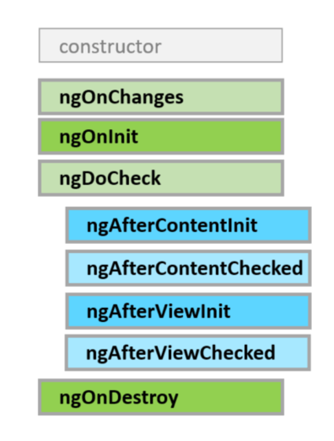

# [译] Angular: 使用 RxJS Observables 来实现简易版的无限滚动加载指令

> 原文链接: [https://codeburst.io/angular-2-simple-infinite-scroller-directive-with-rxjs-observables-a989b12d4fb1](https://codeburst.io/angular-2-simple-infinite-scroller-directive-with-rxjs-observables-a989b12d4fb1)


这篇文章是我上篇文章 [使用响应式编程来实现简易版的无限滚动加载](./Naive-Infinite-Scroll-In-Reactive-Programming-Using-RxJS-Observables.md) 的延续。在本文中，我们将创建一个 Angular 指令来实现无限滚动加载功能。我们还将继续使用 [HackerNews 的非官方 API](https://github.com/cheeaun/node-hnapi) 来获取数据以填充到页面中。

我使用 `angular-cli` 来搭建项目。

```shell
ng new infinite-scroller-poc --style=scss
```

项目生成好后，进入 `infinite-scroller-poc` 目录下。

Angular CLI 提供了一堆命令用来生成组件、指令、服务和模块。

我们来生成一个服务和一个指令。

```shell
ng g service hacker-news
ng g directive infinite-scroller
```

_注意: Angular CLI 会自动在 `app.module.ts` 里注册指令，但不会将服务添加到 `providers` 数组中。你需要手动添加。`app.module.ts` 如下所示。_

```ts
import { BrowserModule } from '@angular/platform-browser';
import { NgModule } from '@angular/core';
import { HttpModule } from '@angular/http';

import { AppComponent } from './app.component';
import { InfiniteScrollerDirective } from './infinite-scroller.directive';
import { HackerNewsService } from './hacker-news.service';
@NgModule({
  declarations: [
    AppComponent,
    InfiniteScrollerDirective
  ],
  imports: [
    BrowserModule,
    HttpModule
  ],
  providers: [HackerNewsService],
  bootstrap: [AppComponent]
})
export class AppModule { }
```

接下来，我们在服务中添加 HackerNews 的 API 调用。下面是 `hacker-news.service.ts`，它只有一个函数 `getLatestStories` 。

```ts
import { Injectable } from '@angular/core';
import { Http } from '@angular/http';

const BASE_URL = 'http://node-hnapi.herokuapp.com';

@Injectable()
export class HackerNewsService {
  
  constructor(private http: Http) { }

  getLatestStories(page: number = 1) {
    return this.http.get(`${BASE_URL}/news?page=${page}`);
  }
}
```

现在来构建我们的无限滚动加载指令。下面是指令的完整代码，别担心代码太长，我们会分解来看。

```ts
import { Directive, AfterViewInit, ElementRef, Input } from '@angular/core';

import { Observable, Subscription } from 'rxjs/Rx';
import 'rxjs/add/observable/fromEvent';
import 'rxjs/add/operator/pairwise';
import 'rxjs/add/operator/map';
import 'rxjs/add/operator/exhaustMap';
import 'rxjs/add/operator/filter';
import 'rxjs/add/operator/startWith';

interface ScrollPosition {
  sH: number;
  sT: number;
  cH: number;
};

const DEFAULT_SCROLL_POSITION: ScrollPosition = {
  sH: 0,
  sT: 0,
  cH: 0
};

@Directive({
  selector: '[appInfiniteScroller]'
})
export class InfiniteScrollerDirective implements AfterViewInit {

  private scrollEvent$;

  private userScrolledDown$;

  private requestStream$;

  private requestOnScroll$;

  @Input()
  scrollCallback;

  @Input()
  immediateCallback;

  @Input()
  scrollPercent = 70;

  constructor(private elm: ElementRef) { }

  ngAfterViewInit() {

    this.registerScrollEvent();

    this.streamScrollEvents();

    this.requestCallbackOnScroll();

  }

  private registerScrollEvent() {

    this.scrollEvent$ = Observable.fromEvent(this.elm.nativeElement, 'scroll');

  }

  private streamScrollEvents() {
    this.userScrolledDown$ = this.scrollEvent$
      .map((e: any): ScrollPosition => ({
        sH: e.target.scrollHeight,
        sT: e.target.scrollTop,
        cH: e.target.clientHeight
      }))
      .pairwise()
      .filter(positions => this.isUserScrollingDown(positions) && this.isScrollExpectedPercent(positions[1]))
  }

  private requestCallbackOnScroll() {

    this.requestOnScroll$ = this.userScrolledDown$;

    if (this.immediateCallback) {
      this.requestOnScroll$ = this.requestOnScroll$
        .startWith([DEFAULT_SCROLL_POSITION, DEFAULT_SCROLL_POSITION]);
    }

    this.requestOnScroll$
      .exhaustMap(() => { return this.scrollCallback(); })
      .subscribe(() => { });

  }

  private isUserScrollingDown = (positions) => {
    return positions[0].sT < positions[1].sT;
  }

  private isScrollExpectedPercent = (position) => {
    return ((position.sT + position.cH) / position.sH) > (this.scrollPercent / 100);
  }

}
```

指令接收3个输入值:

  1. `scrollPercent` - 用户需要滚动到容器的百分比，达到后方可调用 `scrollCallback` 。
  1. `scrollCallback` - 返回 observable 的回调函数。
  1. `immediateCallback ` - 布尔值，如果为 true 则指令初始化后会立即调用 `scrollCallback` 。

Angular 为组件和指令提供了4个生命周期钩子。



对于这个指令，我们想要进入 `ngAfterViewInit` 生命周期钩子以注册和处理滚动事件。在 `constructor` 中，我们注入了 `ElementRef`，它可以让我们引用应用了指令的元素，即滚动容器。

```ts
constructor(private elm: ElementRef) { }

ngAfterViewInit() {

    this.registerScrollEvent();  

    this.streamScrollEvents();

    this.requestCallbackOnScroll();

}
```

在 `ngAfterViewInit` 生命周期钩子中，我们执行了3个函数:

  1. `registerScrollEvent` - 使用 `Observable.fromEvent` 来监听元素的滚动事件。
  1. `streamScrollEvents` - 根据我们的需求来处理传入的滚动事件流，当滚动到给定的容器高度百分比时发起 API 请求。
  1. `requestCallbackOnScroll` - 一旦达到我们设定的条件后，调用 `scrollCallback` 来发起 API 请求。

还有一个可选的输入条件 `immediateCallback`，如果设置为 true 的话，我们会将 `DEFAULT_SCROLL_POSITION` 作为流的起始数据，它会触发 `scrollCallback` 而无需用户滚动页面。这样的话会调用一次 API 以获取初始数据展示在页面中。上述所有函数的作用都与我的上篇[文章](./Naive-Infinite-Scroll-In-Reactive-Programming-Using-RxJS-Observables.md)中是一样的，上篇文章中已经详细地解释了 RxJS Observable 各个操作符的用法，这里就不赘述了。

接下来将无限滚动指令添加到 `AppComponent` 中。下面是 `app.component.ts` 的完整代码。

```ts
import { Component } from '@angular/core';
import { HackerNewsService } from './hacker-news.service';

@Component({
  selector: 'app-root',
  templateUrl: './app.component.html',
  styleUrls: ['./app.component.css']
})
export class AppComponent {

  currentPage: number = 1;

  news: Array<any> = [];

  scrollCallback;

  constructor(private hackerNewsSerivce: HackerNewsService) {

    this.scrollCallback = this.getStories.bind(this);

   }

  getStories() {
    return this.hackerNewsSerivce.getLatestStories(this.currentPage).do(this.processData);
  }

  private processData = (news) => {
    this.currentPage++;
    this.news = this.news.concat(news.json());
  }

}
```

`getStories` - 调用 `hackerNewsService` 并处理返回数据。

**注意 constructor  中的 `this.scrollCallback` 写法**

```ts
this.scrollCallback = this.getStories.bind(this);
```

我们将 `this.getStories` 函数赋值给 `scrollCallback` 并将其上下文绑定为 `this` 。这样可以确保当回调函数在无限滚动指令里执行时，它的上下文是 `AppComponent` 而不是 `InfiniteScrollerDirective` 。更多关于 `.bind` 的用法，可以参考[这里](https://developer.mozilla.org/en/docs/Web/JavaScript/Reference/Global_objects/Function/bind)。

```html
<ul id="infinite-scroller"
  appInfiniteScroller
  scrollPerecnt="70"
  immediateCallback="true"
  [scrollCallback]="scrollCallback"
  >
    <li *ngFor="let item of news">{{item.title}}</li>
</ul>
```

html 想当简单，`ul` 作为 `appInfiniteScroller` 指令的容器，同时还传入了参数 `scrollPercent`、`immediateCallback` 和 `scrollCallback`。每个 `li` 表示一条新闻，并只显示新闻的标题。

为容器设置基础样式。

```css
#infinite-scroller {
  height: 500px;
  width: 700px;
  border: 1px solid #f5ad7c;
  overflow: scroll;
  padding: 0;
  list-style: none;

  li {
    padding : 10px 5px;
    line-height: 1.5;
    &:nth-child(odd) {
      background : #ffe8d8;
    }
    &:nth-child(even) {
      background : #f5ad7c;
    }
  }
}
```

下面的示例是使用了 Angular 指令的无限滚动加载，注意观察右边的滚动条。

在线示例: [https://ashwin-sureshkumar.github.io/angular-infinite-scroller/](https://ashwin-sureshkumar.github.io/angular-infinite-scroller/)

我无法将 gif 图片上传到此处。这是 gif 图片的链接: [http://giphy.com/gifs/xTiN0FRfyHfO538Tsc](http://giphy.com/gifs/xTiN0FRfyHfO538Tsc) 。

如果你喜欢本文的话，欢迎分享、评论及点 💚 。
