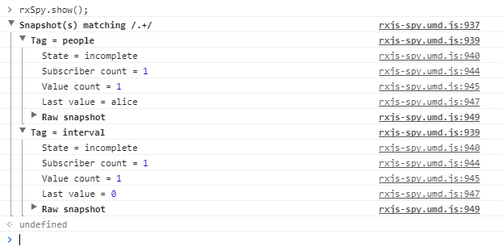
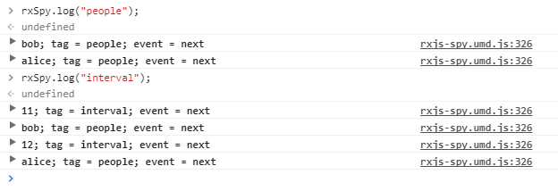
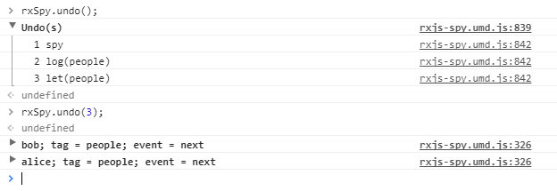
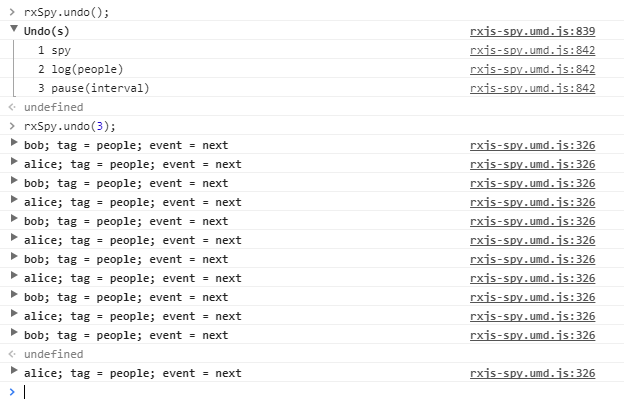

# [译] 调试 RxJS 第1部分: 工具篇

> 原文链接: [https://blog.angularindepth.com/debugging-rxjs-4f0340286dd3](https://blog.angularindepth.com/debugging-rxjs-4f0340286dd3)


我是一位 RxJS 信徒，在我所有活跃的项目中都在使用它。用了它之后，我发现很多乏味的事现在都变得很简单。然而，有一件事却没有任何好转，那就是调试。

由于 RxJS 的可组合性与有时是异步的本质使得调试变成了一种挑战：没有太多的状态可以观察，而且调用堆栈基本也没什么帮助。我之前的做法是在整个代码库中穿插大量的 `do` 操作符和日志来检查流经组合 observables 的值。由于以下几点原因，我对这种方法并不满意：

  * 我总是在不断地添加日志，调试的同时还要更改代码
  * 调试完成后，对于日志，我要么一条条的进行手动删除，要么选择忍受
  * 匆忙之中将 `do` 操作符随意放置在一个组合 observable 中间时，应该避免有条件的日志输出的太恐怖
  * 即使是专门的日志操作符，其体验也不理想

最近，我花费了一些时间开发了一个 RxJS 的调试工具。它有如下几个功能，而且我觉得是这个工具必须要具备的：

  * 它应该尽可能地不唐突
  * 它应该不需要靠不断修改代码来进行调试
  * 特别是，它应该不需要解决问题后靠手动删除或注释掉调试代码
  * 它应该支持可以轻松启用和禁用的日志
  * 它应该支持捕获可以随时间进行比较的快照
  * 它应该提供一些与浏览器控制台的集成，用于打开/关闭调试功能和检查状态，等等

还有一些功能，如果能有就更好了：

  * 它应该支持暂停 observables
  * 它应该支持修改 observables 或 observables 发出的值
  * 它应该支持除控制台之外的日志机制
  * 它应该是可扩展的
  * 它应该采取一些方法来捕获可视化订阅依赖所需的数据

综合考虑这些功能后，我开发了 `rxjs-spy` 。

## 核心概念

`rxjs-spy` 引入了 `tag` 操作符，它将一个字符串标签和一个 observable 关联起来。这个操作符并没有以任何方式来改变 observable 的行为和值。

`tag` 操作符可以单独使用:  `import "rxjs-spy/add/operator/tag" ` 。这样的话，`rxjs-spy` 的其他方法会在生成版本中被忽略，所以唯一的开销就是字符串的使用 (导入)。

大多数工具方法都接受匹配器 ( matchers )，以确定它们即将应用哪些标记过的 observables 。匹配器可以是简单的字符串、正则表达式或传递标签本身的函数谓词 ( predicates )。

当通过调用工具的 `spy` 方法配置后，它会在 `Observable.prototype.subscribe` 上打补丁，这样它就能够侦察到所有的订阅、通知和取消订阅。当然，只有被订阅的 observables 才能通过 `spy` 进行侦察。

`rxjs-spy` 公开了一个模块 API 用于在代码中调用，还公开了一个控制台 API 供用户在浏览器的控制台中进行交互。大多数时候，我都是在应用的启动代码中早早地调用模块 API 的 `spy` 方法，然后使用控制台 API 来执行剩下的调试工作。

## 控制台 API 功能

调试时，我通常使用浏览器的控制台来检查和操纵标记过的 observables 。控制台 API 还是通过示例来解释比较容易，下面的代码示例展示了如何与 observables 配合使用：

```typescript
import { Observable } from "rxjs/Observable";
import { spy } from "rxjs-spy";

import "rxjs/add/observable/interval";
import "rxjs/add/operator/map";
import "rxjs/add/operator/mapTo";
import "rxjs-spy/add/operator/tag";

spy();

const interval = new Observable
  .interval(2000)
  .tag("interval");

const people = interval
  .map((value) => {
    const names = ["alice", "bob"];
    return names[value % names.length];
  })
  .tag("people")
  .subscribe();
```

`rxjs-spy` 的控制台 API 是通过全局变量 `rxSpy` 公开的。

调用 `rxSpy.show()` 会显示所有标记过的 observables 列表，并表明它们的状态 (未完成、已完成或报错)、订阅者的数量以及最新发出的值 (如果有值发出的话)。控制台输出是像这样的：



要显示某个特定的标记 observable，需要将标签名或正则表达式传给 `show`：


通过调用 `rxSpy.log` 可以启用某个标记 observable 的日志：



调用 `log` 时不带任何参数会启用所有标记 observables 的日志。

模块 API 的大部分方法会返回一个拆解函数，它用来解除方法的调用。在控制台中管理这些太麻烦了，所以还有另外一种选择。

调用 `rxSpy.undo()` 会显示所有调用过的方法的列表：


 使用方法调用相关联的数字来调用 `rxSpy.undo` 会直接调用调用方法的拆解函数。例如，调用 `rxSpy.undo(3)` 会看到 `interval` observable 的日志停止输出：


有时候，当调试的同时修改 observable 或它的值是很有用的。控制台 API 包含 `let` 方法，它的作用同 RxJS 中的 `let` 操作符十分相似。它的实现方式是这样的：调用 `let` 方法会影响到标记 observable 的当前订阅者和将来的订阅者。例如，下图中的调用会看到 `people` observable 发出 `mallory `，而不是 `alice` 或 `bob`：


同 `log` 方法一样，`let` 方法的调用也可以取消：



对我来说，调试时能够暂停 observable 的功能几乎是不可或缺的。调用 `rxSpy.pause` 会暂停标记 observable 并返回一个用于控制和检查 observable 通知的 deck 对象：


调用 deck 的 `log` 方法会显示 observable 是否暂停和暂停期间的所有通知 (通知是使用 `materialize` 操作符获取的 RxJS 的 `Notification` 实例)。


调用 deck 的 `setp` 方法会发出一条通知：


调用 `resume` 方法会发出所有暂停期间的通知并恢复 observable：


调用 `pause` 会看到 observable 再次回到暂停状态：


很容易会忘记将返回的 deck 赋值给了哪个变量，所以控制台 API 还提供了 `deck` 方法，它的行为类似于 `undo` 方法。调用它会显示所有 `pause` 调用的列表：


使用 `pause` 调用相关联的数字来调用 `deck` 方法并会返回相关联的 deck 对象：


就像 `log` 和 `let` 调用一样，`pause` 调用也可以取消，并且取消 `pause` 调用会恢复标记的 observable：



希望上面的示例会让你对 `rxjs-spy` 以及它的控制台 API 有一个大致的了解。「 调试 RxJS 」系统的后续部分会专注于 `rxjs-spy` 的具体功能，以及如何使用它来解决实际的调试问题。

对于我而言，`rxjs-spy` 确实可以使调试 RxJS 变得有趣起来。

## 更多信息

`rxjs-spy` 的源码托管在 [GitHub](https://github.com/cartant/rxjs-spy) 上，这里有[一个可以操作控制台 API 的在线示例](https://cartant.github.io/rxjs-spy/)。

还可以通过 [NPM](https://www.npmjs.com/package/rxjs-spy) 来安装包。

本系统的下篇文章 —「 调试 RxJS 第2部分：日志篇 」(下次翻译，敬请期待)