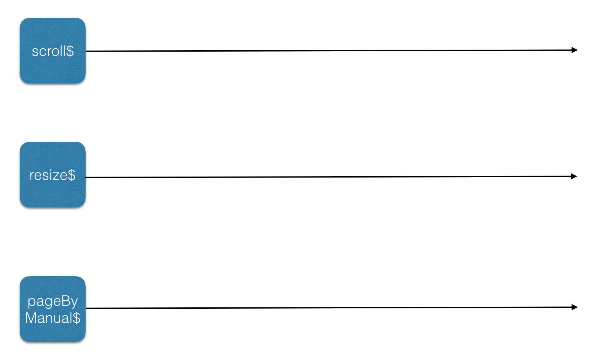
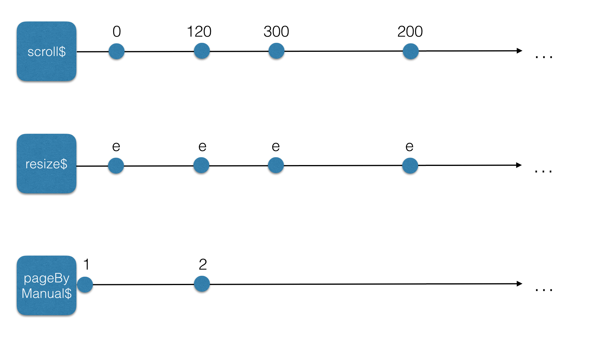
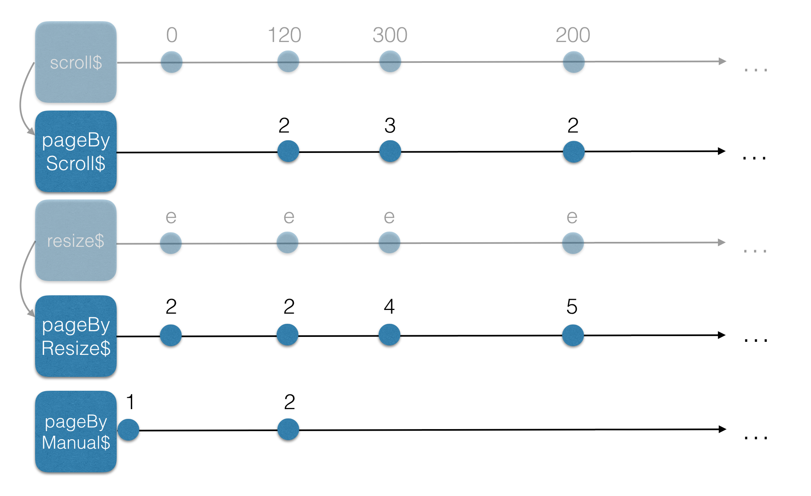
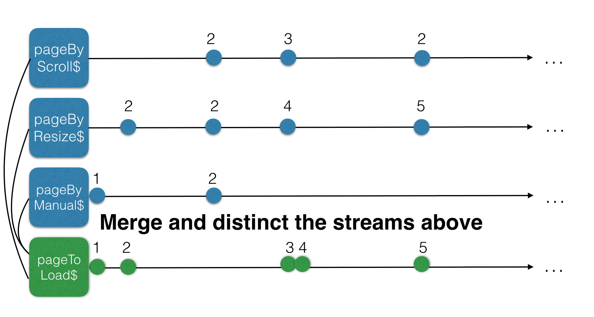
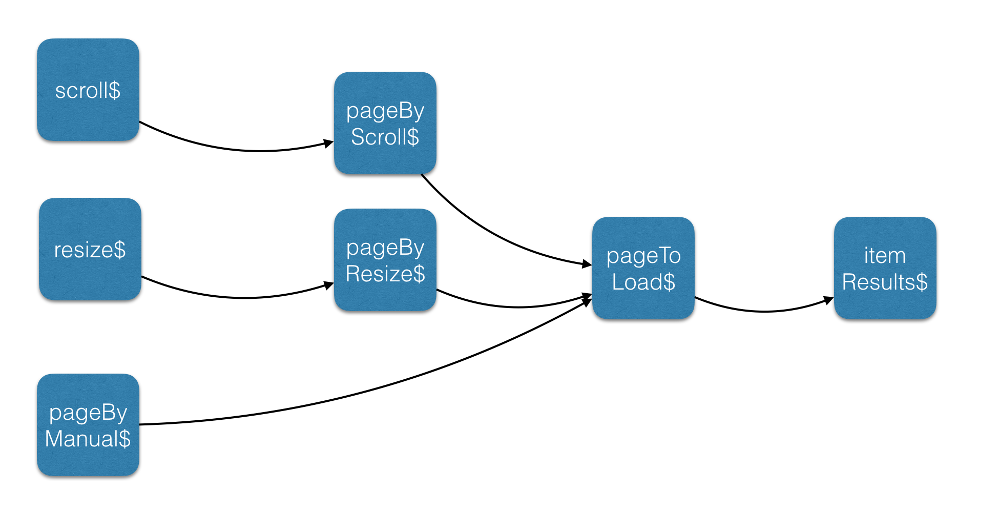

# [译] 使用 Angular 和 RxJS 实现的无限滚动加载

> 原文链接: [https://blog.strongbrew.io/infinite-scroll-with-rxjs-and-angular2/](https://blog.strongbrew.io/infinite-scroll-with-rxjs-and-angular2/)

## 关于本文

本文讲解了如何使用“响应式编程”的方式以少量的代码实现出超棒的**无限滚动加载列表**。对于本文，我们将使用 [RxJS](http://reactivex.io/rxjs/) 和 [Angular](https://angular.io/)。如果 [RxJS](http://reactivex.io/rxjs/) 对你来说是全新概念的话，那么最好先阅读下官方文档。但无论是使用 [Angular](https://angular.io/) 还是 [React](https://facebook.github.io/react/)，都不会影响到本文的流畅度。

## 响应式编程

相比于命令式编程，响应式编程有如下优势:

  * 不再有“if xx, else xx” 这种场景
  * 可以忘记大量的边缘案例
  * 很容易将展现层逻辑跟其他逻辑分离 (展现层只对流作出响应)
  * 本身就是标准: 被广泛的语言所支持
  * 当理解这些概念后，可以以一种非常简单的方式将复杂的逻辑用很少的代码来实现

几天前，我的一个同事来找我探讨问题: 他想要**在 Angular 中实现无限滚动加载**功能，但是他无意间触碰到了命令式编程的边界。而事实也证明了，无限滚动加载解决方案实际上是一个很好的例子，可以解释响应式编程如何帮助你来更好地编写代码。

## 无限滚动加载应该是怎样的？

无限滚动加载列表在用户将页面滚动到指定位置后会异步加载数据。这是避免寻主动加载(每次都需要用户去点击)的好方法，而且它能真正保持应用的性能。同时它还是降低带宽和增强用户体验的有效方法。

对于这种场景，假设说每个页面包含10条数据，并且所有数据都在一个可滚动的长列表中显示，这就是无限滚动加载列表。

我们来把无限滚动加载列表必须要满足的功能列出来:

  * 默认应该加载第一页的数据
  * 当首页的数据不能完全填充首屏的话，应该加载第二页的数据，以此类推，直到首屏填充满
  * 当用户向下滚动，应该加载第三页的数据，并依次类推
  * 当用户调整窗口大小后，有更多空间来展示结果，此时应该加载下一页数据
  * 应该确保同一页数据不会被加载两次 (缓存)

## 首先画图

就像大多数编码决策一样，先在白板上画出来是个好主意。这可能是一种个人方式，但它有助于我编写出的代码不至于在稍后阶段被删除或重构。

根据上面的功能列表来看，有三个动作可以使应用触发加载数据: 滚动、调整窗口大小和手动触发数据加载。当我们用响应式思维来思考时，可以发现有3中事件的来源，我们将其称之为流:

  * scroll 事件的流: **scroll$**
  * resize 事件的流: **resize$**
  * 手动决定加载第几页数据的流: **pageByManual$**

**注意: 我们会给流变量加后缀$以表明这是流，这是一种约定(个人也更喜欢这种方式)**

我们在白板上画出这些流:



随着时间的推移，这些流上会包含具体的值:



`scroll$` 流包含 Y 值，它用来计算页码。

`resize$` 流包含 event 值。我们并不需要值本身，但我们需要知道用户调整了窗口大小。

`pageByManual$` 包含页码，因为它是一个 Subject，所以我们可以直接设置它。(稍后再讲)

如果我们可以将所有这些流映射成页码的流呢？那就太好了，因为基于页码才能加载指定页的数据。那么如何把当前的流映射成页码的流呢？这不是我们现在需要考虑的事情(我们只是在绘图，还记得吗?)。下一个图看起来是这样的:



从图中可以看到，我们基于初始的流创建出了下面的流:

  * **pageByScroll$**: 包含基于 scroll 事件的页码
  * **pageByResize$**: 包含基于 resize 事件的页码
  * **pageByManual$**: 包含基于手动事件的页码 (例如，如果页面上仍有空白区域，我们需要加载下一页数据)

如果我们能够以有效的方式合并这3个页码流，那么我们将得到一个名为 **`pageToLoad$`** 的新的流，它包含由 scroll 事件、resize 事件和手动事件所创建的页码。



如果我们订阅 `pageToLoad$` 流而不从服务中获取数据的话，那么我们的无限滚动加载已经可以部分工作了。但是，我们不是要以响应式的思维来思考吗？这就意味着要尽可能地避免订阅... 实际上，我们需要基于 `pageToLoad$` 流来创建一个新的流，它将包含无限滚动加载列表中的数据...


现在将这些图合并成一个全面的设计图。



如果所示，我们有3个输入流: 它们分别负责处理滚动、调整窗口大小和手动触发。然后，我们有3个基于输入流的页码流，并将其合并成一个流，即 `pageToLoad$` 流。基于 `pageToLoad$` 流，我们便可以获取数据。

## 开始编码

图已经画的很充分了，对于无限滚动加载列表要做什么，我们也有了清晰的认知，那么我们开始编码吧。

要计算出需要加载第几页，我们需要2个属性:

```ts
private itemHeight = 40;
private numberOfItems = 10; // 页面中的项数
```

### pageByScroll$

`pageByScroll$` 流如下所示:

```ts
private pageByScroll$ = 
  // 首先，我们要创建一个流，它包含发生在 window 对象上的所有滚动事件
	Observable.fromEvent(window, "scroll") 
  // 我们只对这些事件的 scrollY 值感兴趣
  // 所以创建一个只包含这些值的流
	.map(() => window.scrollY)
  // 创建一个只包含过滤值的流
  // 我们只需要当我们在视口外滚动时的值
	.filter(current => current >=  document.body.clientHeight - window.innerHeight)
  // 只有当用户停止滚动200ms后，我们才继续执行
  // 所以为这个流添加200ms的 debounce 时间
	.debounceTime(200) 
  // 过滤掉重复的值
	.distinct() 
  // 计算页码
	.map(y => Math.ceil((y + window.innerHeight)/ (this.itemHeight * this.numberOfItems)));
	
	// --------1---2----3------2...
```

**注意: 在真实应用中，你可能想要使用 window 和 document 的注入服务**

### pageByResize$

`pageByResize$` 流如下所示:

```ts
  private pageByResize$ = 
  // 现在，我们要创建一个流，它包含发生在 window 对象上的所有 resize 事件
	Observable.fromEvent(window, "resize")
  // 当用户停止操作200ms后，我们才继续执行
	.debounceTime(200) 
  // 基于 window 计算页码
   .map(_ => Math.ceil(
	   	(window.innerHeight + document.body.scrollTop) / 
	   	(this.itemHeight * this.numberOfItems)
   	));
   
	// --------1---2----3------2...
```

### pageByManual$

`pageByManual$` 流用来获取初始值(首屏数据)，但它同样需要我们手动控制。`BehaviorSubject` 非常适合，因为我们需要一个带有初始值的流，同时我们还可以手动添加值。

```ts
private pageByManual$ = new BehaviorSubject(1);

// 1---2----3------...
```

### pageToLoad$

酷，已经有了3个页码的输入流，现在我们来创建 `pageToLoad$` 流。

```ts
private pageToLoad$ = 
  // 将所有页码流合并成一个新的流
	Observable.merge(this.pageByManual$, this.pageByScroll$, this.pageByResize$)
  // 过滤掉重复的值
	.distinct() 
  // 检查当前页码是否存在于缓存(就是组件里的一个数组属性)之中
	.filter(page => this.cache[page-1] === undefined); 
```

### itemResults$

最难的部分已经完成了。现在我们拥有一个带页码的流，这十分有用。我们不再需要关心个别场景或是其他复杂的逻辑。每次 `pageToLoad$` 流有新值时，我们就只加载数据即可。**就这么简单！！**

我们将使用 [`flatmap`](http://reactivex.io/documentation/operators/flatmap.html) 操作符来完成，因为调用数据本身返回的也是流。FlatMap (或 MergeMap) 会将高阶 Observable 打平。

```ts
itemResults$ = this.pageToLoad$ 
  // 基于页码流来异步加载数据
  // flatMap 是 meregMap 的别名
	.flatMap((page: number) => {
    // 加载一些星球大战中的角色
		return this.http.get(`https://swapi.co/api/people?page=${page}`)
      // 创建包含这些数据的流
			.map(resp => resp.json().results)
			.do(resp => {
        // 将页码添加到缓存中
				this.cache[page -1] = resp;
        // 如果页面仍有足够的空白空间，那么继续加载数据 :)
				if((this.itemHeight * this.numberOfItems * page) < window.innerHeight){
					this.pageByManual$.next(page + 1);
				}
			})
		})
  // 最终，只返回包含数据缓存的流
	.map(_ => flatMap(this.cache)); 
```

### 结果

完整的代码如下所示: 

**注意 [async pipe](https://angular.io/guide/pipes#the-impure-asyncpipe) 负责整个订阅流程**。

```ts
@Component({
  selector: 'infinite-scroll-list',
  template: `
  <table>
   <tbody>
    <tr *ngFor="let item of itemResults$ | async" [style.height]="itemHeight + 'px'">
      <td></td>
    </tr>
   </tbody>
   </table>
  `
})
export class InfiniteScrollListComponent {
  private cache = []; 
  private pageByManual$ = new BehaviorSubject(1);
  private itemHeight = 40;
  private numberOfItems = 10; 

  private pageByScroll$ = Observable.fromEvent(window, "scroll")
    .map(() => window.scrollY)
    .filter(current => current >=  document.body.clientHeight - window.innerHeight)
    .debounceTime(200) 
    .distinct() 
    .map(y => Math.ceil((y + window.innerHeight)/ (this.itemHeight * this.numberOfItems)));
       
  private pageByResize$ = Observable.fromEvent(window, "resize")
    .debounceTime(200) 
    .map(_ => Math.ceil(
        (window.innerHeight + document.body.scrollTop) / 
        (this.itemHeight * this.numberOfItems)
      ));

    
  private pageToLoad$ = Observable
    .merge(this.pageByManual$, this.pageByScroll$, this.pageByResize$)
    .distinct() 
    .filter(page => this.cache[page-1] === undefined); 
    
  itemResults$ = this.pageToLoad$ 
    .do(_ => this.loading = true)
    .flatMap((page: number) => {
      return this.http.get(`https://swapi.co/api/people?page=${page}`)
          .map(resp => resp.json().results)
      		.do(resp => {
				this.cache[page -1] = resp;
				if((this.itemHeight * this.numberOfItems * page) < window.innerHeight){
					this.pageByManual$.next(page + 1);
				}
          })
    })
    .map(_ => flatMap(this.cache)); 
  
  constructor(private http: Http){ 
  } 
}
```

这是[在线示例](http://plnkr.co/edit/WewXnQRj9xBA7yPveWLQ?p=preview)的地址。(译者注: 报错跑不起来。。。囧)

再一次 (正如我之前文章中所证明的)，我们不需要使用第三方解决方案来解决所有问题。无限滚动加载列表的代码并不多，而且还非常灵活。假设说我们想减少 DOM 的压力，每次加载100条数据，那么我们可以新创建一个流来做这件事 :)

感谢阅读本文，希望你能喜欢。