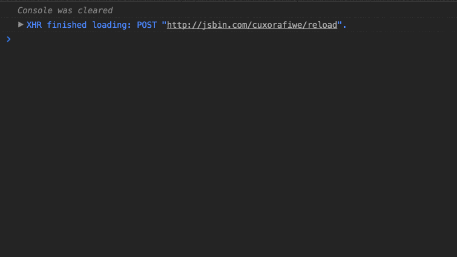

# [译] RxJS: 6个你必须知道的操作符

> 原文链接: [https://netbasal.com/rxjs-six-operators-that-you-must-know-5ed3b6e238a0](https://netbasal.com/rxjs-six-operators-that-you-must-know-5ed3b6e238a0)

## 1. concat

```javascript
// 模拟 HTTP 请求
const getPostOne$ = Rx.Observable.timer(3000).mapTo({id: 1});
const getPostTwo$ = Rx.Observable.timer(1000).mapTo({id: 2});

Rx.Observable.concat(getPostOne$, getPostTwo$).subscribe(res => console.log(res));
```

## **_按顺序订阅 Observables，但是只有当一个完成并让我知道，然后才会开始下一个。_**


当顺序很重要时，使用此操作符，例如当你需要按顺序的发送 HTTP 请求时。

## 2. forkJoin

`forkJoin` 是 Rx 版的 `Promise.all()` 。

```javascript
const getPostOne$ = Rx.Observable.timer(1000).mapTo({id: 1});
const getPostTwo$ = Rx.Observable.timer(2000).mapTo({id: 2});

Rx.Observable.forkJoin(getPostOne$, getPostTwo$).subscribe(res => console.log(res)) 
```

## **_别让我知道直到所有的 Observables 都完成了，然后再一次性的给我所有的值。(以数组的形式)_**


当你需要并行地运行 Observables 时使用此操作符。

## 3. mergeMap 

```javascript
const post$ = Rx.Observable.of({id: 1});
const getPostInfo$ = Rx.Observable.timer(3000).mapTo({title: "Post title"});

const posts$ = post$.mergeMap(post => getPostInfo$).subscribe(res => console.log(res));
```

首先，我们得理解 Observables 世界中的两个术语:

  1. 源 (或外部) Observable - 在本例中就是 `post$` Observable 。
  2. 内部 Observable - 在本例中就是 `getPostInfo$` Observable 。

## **_仅当内部 Obervable 发出值时，通过合并值到外部 Observable 来让我知道。_**


## 4. pairwise

```javascript
// 追踪页面滚动增量
Rx.Observable
  .fromEvent(document, 'scroll')
  .map(e => window.pageYOffset)
  .pairwise()
  .subscribe(pair => console.log(pair)); // pair[1] - pair[0]
```

## **_当 Observable 发出值时让我知道，但还得给我前一个值。(以数组的形式)_**

页面滚动…


从输入 Observable 的第二个值开始触发。

## 5. switchMap 

```javascript
const clicks$ = Rx.Observable.fromEvent(document, 'click');
const innerObservable$ = Rx.Observable.interval(1000);

clicks$.switchMap(event => innerObservable$)
                    .subscribe(val => console.log(val));
```

## **_类似于 mergeMap，但是当源 Observable 发出值时会取消内部 Observable 先前的所有订阅 。_**

在我们的示例中，每次我点击页面的时，先前的 `interval` 订阅都会取消，然后开启一个新的。


## 6. combineLatest 

```javascript
const intervalOne$ = Rx.Observable.interval(1000);
const intervalTwo$ = Rx.Observable.interval(2000);

Rx.Observable.combineLatest(
    intervalOne$,
    intervalTwo$ 
).subscribe(all => console.log(all));
```

## **_当任意 Observable 发出值时让我知道，但还要给我其他 Observalbes 的最新值。(以数组的形式)_**



例如当你需要处理应用中的过滤器时，此操作符非常有用。

如果你想了解更多关于 Observables 的内容，可以阅读我的文章:

1. [Observables under the hood](https://netbasal.com/javascript-observables-under-the-hood-2423f760584#.ptzobjg31).
2. [Understanding Subjects In Rx](https://netbasal.com/understanding-subjects-in-rxjs-55102a190f3#.302oa6o3w).